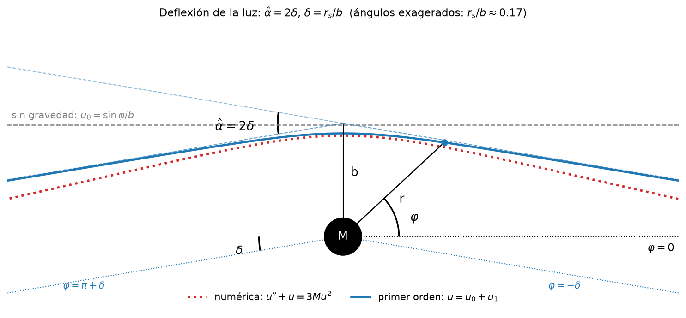

# Deflexión de la luz en la métrica de Schwarzschild

Relatividad General — Presentación 1, Tema 1 (Tests de la Relatividad General).

Notebook de Jupyter que deriva el ángulo de deflexión de la luz, $\hat\alpha = 4GM/(c^2 b)$, a partir de las geodésicas nulas de Schwarzschild, lo verifica con SymPy, lo compara con la integral exacta calculada numéricamente, aplica el resultado al Sol (≈1.75″) y estudia la divergencia en la esfera de fotones.



## Uso

```bash
pip install numpy scipy sympy matplotlib jupyter
jupyter notebook deflexion_luz_schwarzschild.ipynb
```

`build_notebook.py` regenera el notebook (sin salidas ejecutadas).
